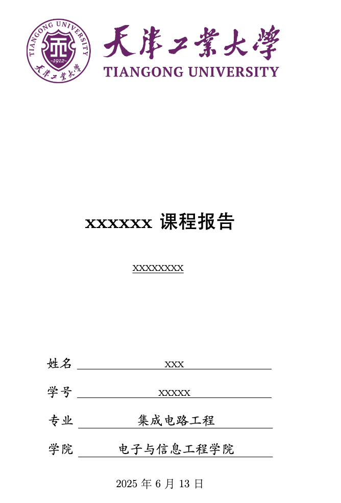
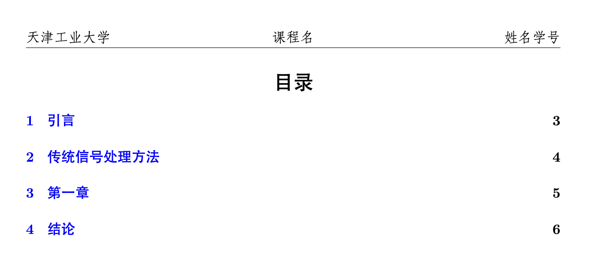
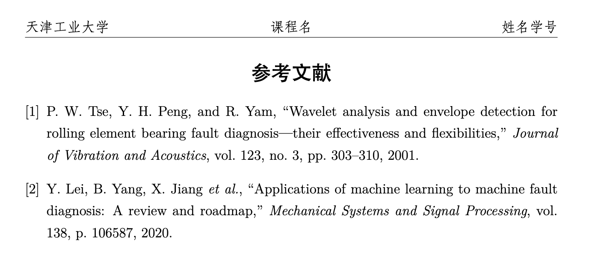

# 天津工业大学 LaTeX 模板

这是一个为天津工业大学学生设计的 LaTeX 课程报告模板。该模板提供了一个标准化的格式，适用于各类课程报告、实验报告等学术文档的撰写。

本模板基于 [UCAS_Latex_Template](https://github.com/jweihe/UCAS_Latex_Template.git) 进行改进和定制，以适应天津工业大学的需求。

## 模板特点

- 符合天津工业大学学术文档规范
- 包含完整的中文支持
- 预设了标准的报告结构（封面、摘要、目录、正文、参考文献等）
- 提供了常用的数学环境和定理环境
- 自定义的页眉页脚设置
- 参考文献自动生成功能

## 目录结构

- `TGUReport.sty` - 模板样式文件
- `main.tex` - 主文档文件（示例）
- `reference.bib` - 参考文献 BibTeX 文件
- `figures/` - 图片目录
  - `tgu_logo.png` - 天津工业大学校徽
  - 其他示例效果图

## 效果展示

### 封面



### 目录



### 参考文献



## 使用方法

### 快速开始

1. 克隆或下载此仓库
2. 使用支持 LaTeX 的编辑器（如 TeXstudio、Overleaf、VS Code + LaTeX Workshop 等）打开 `main.tex`
3. 使用 XeLaTeX 编译器编译文档

### 编译命令

```bash
xelatex main.tex
bibtex main
xelatex main.tex
xelatex main.tex
```

### 自定义内容

1. 在 `main.tex` 中修改标题、作者、学号等信息
2. 在 `TGUReport.sty` 中可以修改页眉页脚信息
3. 在 `reference.bib` 中添加参考文献条目

## 模板结构说明

### 封面设置

封面包含天津工业大学校徽、课程名称、报告标题、学生信息等内容。可以在 `main.tex` 中修改相关信息。

### 摘要与关键词

```latex
\begin{abstract}
摘要内容...
\end{abstract}
\keywords{关键词1, 关键词2, 关键词3}
```

### 目录生成

```latex
\tableofcontents
```

### 正文结构

使用标准的 LaTeX 章节命令：

```latex
\section{章节名}
\subsection{小节名}
```

### 图表插入

```latex
\begin{figure}[htbp]
\centering
\includegraphics[width=0.8\textwidth]{figures/图片名.png}
\caption{图片标题}
\end{figure}
```

### 参考文献

在 `reference.bib` 中按 BibTeX 格式添加参考文献条目，然后在正文中使用 `\cite{引用标识符}` 进行引用。在文档末尾使用 `\reference` 命令生成参考文献列表。

## 特殊功能

### 文本框

```latex
\tbox{文本框内容}
```

### 自动引用

```latex
\autoref{标签名}
```

## 许可证

此模板由 Li Jianfei 创建，遵循 MIT 许可证开源。

## 致谢

本模板基于 [jweihe](https://github.com/jweihe) 的 [UCAS_Latex_Template](https://github.com/jweihe/UCAS_Latex_Template.git) 进行改进，特此感谢原作者的工作。

